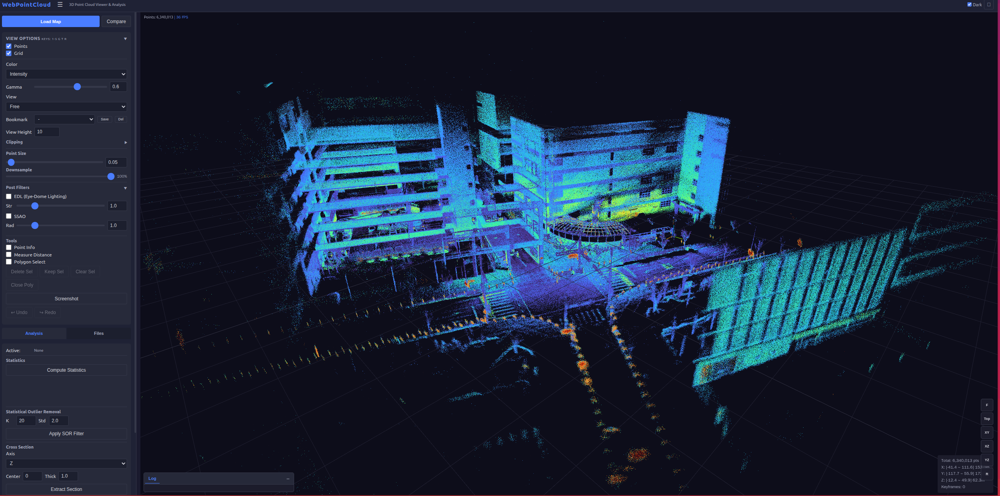
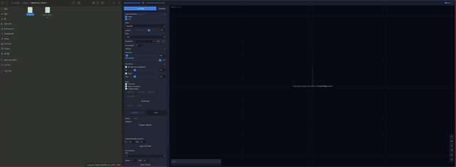
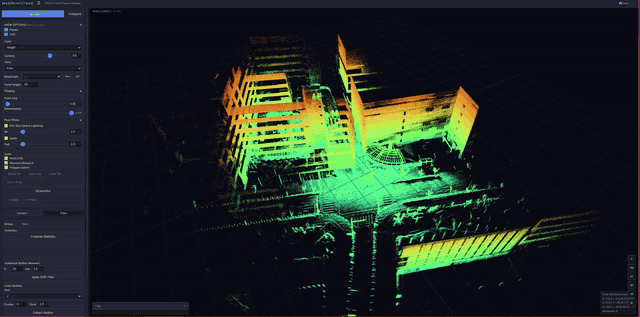
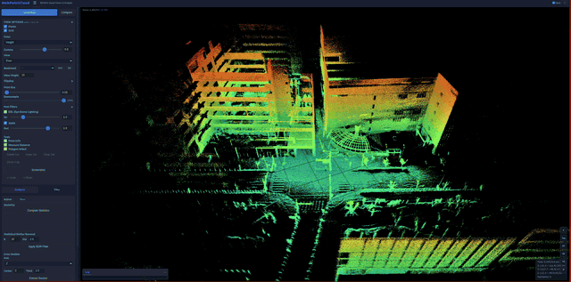

# WebPointCloud

**A web-based 3D point cloud viewer and analysis tool.**  
Load, visualize, and analyze LAS/LAZ point cloud files directly in your browser — no plugins, no desktop app required.



### Demo

**Drag & Drop Loading**



**Post-Processing Filters (EDL / SSAO)**



**View Controls & Color Modes**



---

## Features

### Viewer
- **GPU-Accelerated 3D Rendering** — Powered by Three.js with custom WebGL shaders
- **Color Modes** — Intensity, Height (turbo colormap), RGB
- **Post-Processing** — Eye-Dome Lighting (EDL), Screen-Space Ambient Occlusion (SSAO)
- **Measurement Tools** — Distance measurement, polygon selection, point info
- **Map Comparison** — Overlay two point clouds with transform controls (offset + rotation)
- **Clipping Planes** — X/Y/Z axis clipping
- **Camera Bookmarks** — Save and restore camera positions

### Analysis
- **Statistics** — Point count, bounding box, density, height distribution histogram
- **SOR Filter** — Statistical Outlier Removal (k-nearest neighbors)
- **Cross Section** — Extract slices along any axis
- **Volume Estimation** — 2.5D grid-based volume computation
- **C2C Distance** — Cloud-to-Cloud distance between two point clouds

### General
- **Drag & Drop** — Drop point cloud files directly into the viewer
- **File Management** — Browse, rename, delete saved point clouds
- **Screenshot** — Export the current view as PNG
- **Dark / Light Theme**
- **Responsive UI** — Works on desktop and tablets

---

## Quick Start

```bash
git clone https://github.com/warhammer50K/WebPointCloud.git
cd WebPointCloud
pip install -r requirements.txt
python app.py
```

Open **http://localhost:5000** in your browser, then drag & drop a point cloud file or click **Load Map > Upload File**.

A sample point cloud is included at `sample/building_scan.las` (100k points) — drag it into the viewer to try it out.

## Supported Formats

| Format | Extension | Notes |
|--------|-----------|-------|
| LAS | `.las` | ASPRS LAS 1.2 - 1.4 |
| LAZ | `.laz` | Compressed LAS (via lazrs) |
| PLY | `.ply` | ASCII and binary (little/big endian) |
| XYZ | `.xyz` `.txt` `.csv` | Whitespace or comma delimited |
| PCD | `.pcd` | Point Cloud Library format (ASCII and binary) |
| PTS | `.pts` | Leica / common scanner ASCII format |

## Configuration

| Environment Variable | Default | Description |
|---------------------|---------|-------------|
| `WEB_PORT` | `5000` | HTTP server port |
| `WPC_DATA_DIR` | `~/webpointcloud` | Data directory (maps + logs) |
| `WPC_MAPS_DIR` | `$WPC_DATA_DIR/maps` | Point cloud storage directory |
| `FLASK_DEBUG` | `0` | Enable Flask debug mode |
| `FLASK_SECRET_KEY` | auto-generated | Flask session secret key |

## Architecture

```
Browser ──── HTTP ────── Flask (Python)
  │                        │
  ├─ Three.js 3D viewer    ├─ REST API (/api/*)
  ├─ WebGL shaders         ├─ LAS read/write (laspy)
  ├─ Analysis UI           ├─ Analysis (numpy, scipy)
  └─ Web Workers           └─ File management
```

## Third-Party Libraries

| Library | License | Usage |
|---------|---------|-------|
| [Three.js](https://threejs.org/) | MIT | 3D rendering |
| [pako](https://github.com/nodeca/pako) | MIT + Zlib | Zlib decompression |
| [Flask](https://flask.palletsprojects.com/) | BSD-3 | Web framework |
| [laspy](https://github.com/laspy/laspy) | BSD-2 | LAS file I/O |
| [NumPy](https://numpy.org/) | BSD-3 | Numerical computing |
| [SciPy](https://scipy.org/) | BSD-3 | Spatial algorithms (KDTree, SOR) |

## Contributing

Contributions are welcome! Please open an issue or submit a pull request.

1. Fork the repository
2. Create your feature branch (`git checkout -b feature/my-feature`)
3. Commit your changes (`git commit -m 'Add my feature'`)
4. Push to the branch (`git push origin feature/my-feature`)
5. Open a Pull Request

## License

This project is licensed under the [MIT License](LICENSE).
